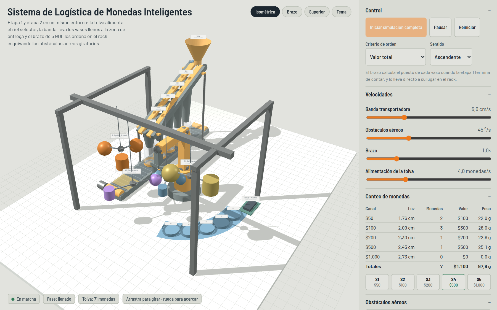
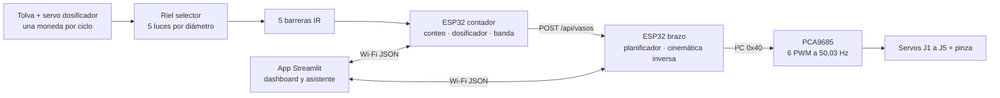
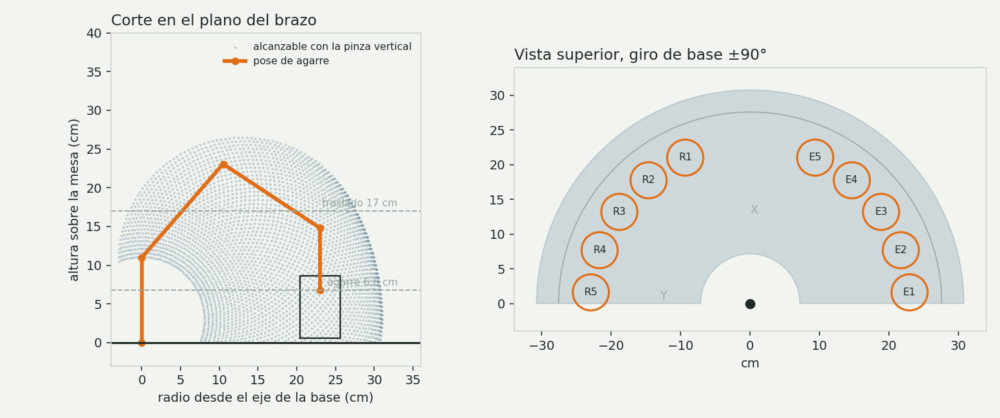
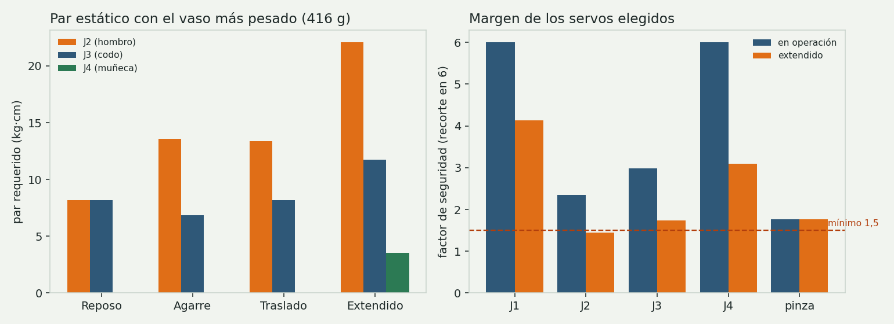
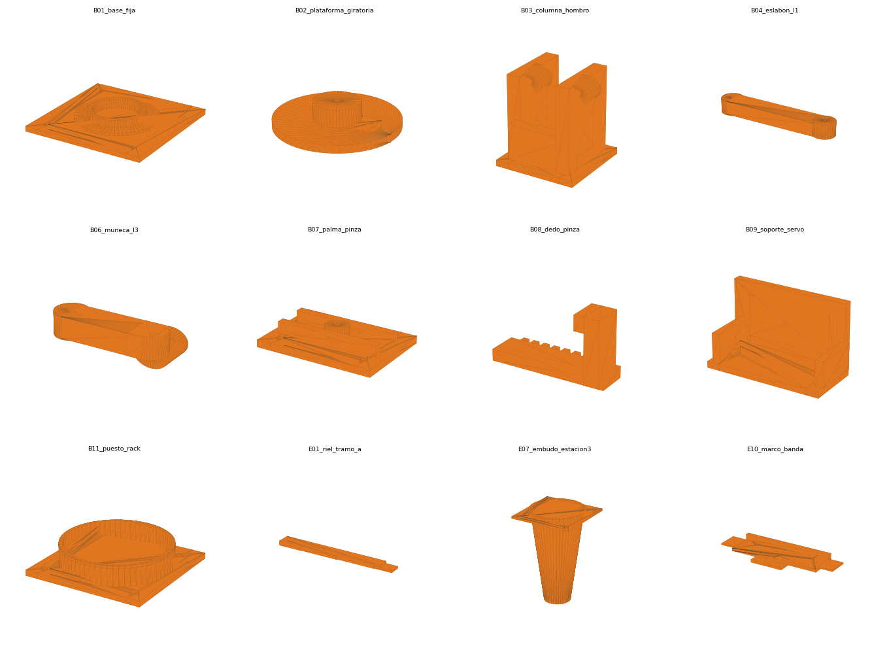
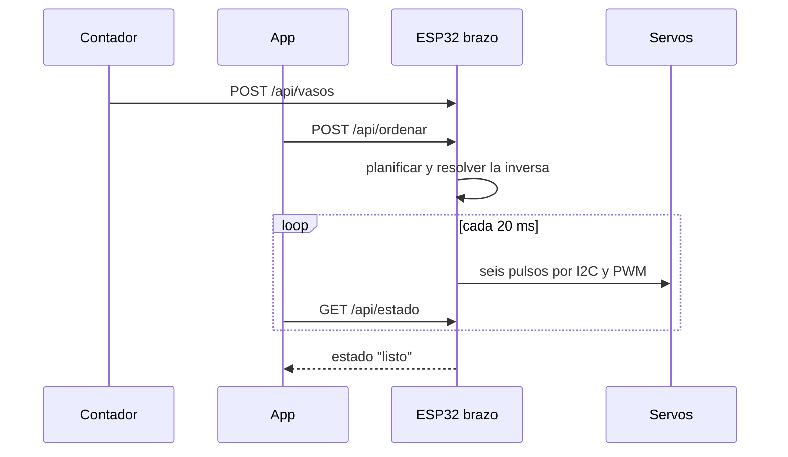

# Sistema de Logística de Monedas Inteligentes

Celda robótica que recibe monedas colombianas a granel, las separa por
denominación, las cuenta, las embala en vasos y los ordena en un rack con un
brazo de 5 GDL que esquiva obstáculos aéreos en movimiento.

Proyecto de Ingeniería Mecatrónica, Universidad Militar Nueva Granada.




---

## Qué hace, en una pasada

| | |
| --- | --- |
| **Entrada** | Monedas mezcladas de $50, $100, $200, $500 y $1.000 en una tolva |
| **Separación** | Riel inclinado 25° con cinco ranuras que se abren por escalones |
| **Conteo** | Una barrera infrarroja por canal; cada pulso es una moneda |
| **Embalaje** | Cinco vasos de 52 mm sobre una banda transportadora |
| **Ordenamiento** | Brazo de 5 GDL + pinza: rack de cinco puestos, por denominación, cantidad, valor o peso |
| **Reto añadido** | Cuatro móviles giratorios sobre la trayectoria, que el brazo esquiva con tres maniobras distintas |
| **Cifras** | 80 monedas por lote, $23.600, 470 g · ciclo de 7,1 s por vaso · carga de diseño 416 g |

Todo el sistema está simulado, calculado y probado antes de construirlo: la
misma cinemática corre en el navegador, en PyBullet, en Python y en el ESP32.

---

## Demos que se abren en el navegador

Publicadas con GitHub Pages sobre la carpeta `docs/`:

| Demo | Qué muestra |
| --- | --- |
| [**Sistema completo**](docs/simulacion_sistema_completo.html) | Las dos etapas en un entorno, los cuatro obstáculos y la evasión en 5 GDL, con consola de tramas |
| [**Etapa 1**](docs/simulacion-etapa1.html) | Riel selector, conteo por canal y banda, con modo despiece de las piezas |
| [**Memoria de cálculo**](docs/memoria-calculo.html) | Cinemática, espacio de trabajo, trayectorias y pares, con calculadoras en vivo |

Ninguna necesita instalación: son archivos HTML autónomos con Three.js.

---

## Arquitectura



| Bloque | Responsabilidad | No hace |
| --- | --- | --- |
| Riel selector | Separa por geometría, sin motores ni sensores de decisión | No cuenta |
| ESP32 contador | Cuenta por interrupción, dosifica y mueve la banda | No decide el orden |
| ESP32 brazo | Guarda el estado de los puestos, planifica, resuelve la inversa y comanda | No calcula el valor del lote |
| PCA9685 | Genera los seis PWM por hardware | No conoce la geometría |
| App Streamlit | Elige criterio y sentido, muestra ruta, valor, peso y cantidad | No calcula cinemática |

---

## Etapa 1: separar y contar

La selección es puramente geométrica. Dos rieles paralelos dejan entre sí una
ranura que se abre por escalones; la moneda desliza plana y cae en cuanto la luz
supera su diámetro, así que el orden de las estaciones es el de los diámetros.

| Estación | Moneda | Diámetro | Luz de la ranura | Masa | Margen con la siguiente |
| --- | --- | --- | --- | --- | --- |
| 1 | $50 | 17,0 mm | 17,6 mm | 2,00 g | 2,7 mm |
| 2 | $100 | 20,3 mm | 20,9 mm | 3,34 g | 1,5 mm |
| 3 | $200 | 22,4 mm | 23,0 mm | 4,61 g | **0,7 mm** |
| 4 | $500 | 23,7 mm | 24,3 mm | 7,14 g | 2,4 mm |
| 5 | $1.000 | 26,7 mm | 27,3 mm | 9,95 g | — |

La inclinación de 25° vence la fricción del PETG: con µ ≈ 0,30 la aceleración
neta es a = g(sen α − µ cos α) = 1,48 m/s², suficiente para que la moneda deslice
sola. El canal más crítico es el de $200 y $500, separados por 1,3 mm de
diámetro; por eso el despiece pide imprimir una probeta y medirla con calibrador
antes del riel completo.

El ESP32 contador cuenta por interrupción con antirrebote de 25 ms, calcula valor
y peso con las masas de la serie 2012 del Banco de la República, y al cerrar la
tanda entrega el lote al brazo:

```
M:500,4                                        evento por moneda
VASOS:50x24,100x20,200x18,500x14,1000x12       resumen de la tanda
```

---

## Etapa 2: ordenar con 5 GDL

Cadena antropomórfica con los tres ejes centrales paralelos, así que la inversa
tiene solución cerrada y el ESP32 la resuelve con seis llamadas trigonométricas,
sin iterar.

| Parámetro | Valor | | Articulación | Rango | Home |
| --- | --- | --- | --- | --- | --- |
| d₁ | 110 mm | | J1 base | −90° a 90° | 0° |
| L₁ | 160 mm | | J2 hombro | 0° a 180° | 90° |
| L₂ | 150 mm | | J3 codo | −150° a 0° | −90° |
| L₃ | 80 mm | | J4 cabeceo | −120° a 60° | −90° |
| Pinza | 0 a 70 mm | | J5 giro | −90° a 90° | 0° |

**Directa** (notación c₁ = cos θ₁, s₂₃ = sen(θ₂+θ₃)):

```
ρ = L₁c₂ + L₂c₂₃ + L₃c₂₃₄
p = (c₁ρ, s₁ρ, d₁ + L₁s₂ + L₂s₂₃ + L₃s₂₃₄)      φ = θ₂ + θ₃ + θ₄
```

**Inversa**, descontando el último eslabón para hallar el centro de muñeca:

```
r_w = r − L₃cos φ          h_w = h − L₃sen φ
D   = (r_w² + h_w² − L₁² − L₂²) / (2L₁L₂)
θ₃  = −arccos D            (codo arriba; la raíz positiva viola el rango de J3)
θ₂  = atan2(h_w, r_w) − atan2(L₂ sen θ₃, L₁ + L₂ cos θ₃)
θ₄  = φ − θ₂ − θ₃
```

Ejemplo verificado en las pruebas, agarre en el puesto R1:

| X | Y | Z | φ | θ₁ | θ₂ | θ₃ | θ₄ | Trama de servos |
| --- | --- | --- | --- | --- | --- | --- | --- | --- |
| 21,01 | 9,35 | 6,80 cm | −90° | 24,00° | 49,02° | −82,53° | −56,50° | `S:114,49,83,64,90,85` |

El producto de las cinco matrices DH coincide con la forma cerrada en 500 poses
aleatorias y con el URDF de PyBullet en otras 200: el error máximo es ruido de
punto flotante (10⁻⁹ cm). `det J = L₁L₂ sen θ₃` solo se anula con el brazo
estirado, que es justo el límite de J3, así que la celda trabaja lejos de la
singularidad.



**Trayectorias.** Perfil quíntico en todos los tramos, con velocidad y
aceleración nulas en los extremos:

```
θ(t) = θ₀ + Δθ(10τ³ − 15τ⁴ + 6τ⁵)     θ̇max = 1,875Δθ/T     θ̈max = 5,7735Δθ/T²
```

El giro más largo (E1 a R5, 172°) tarda 2,29 s con un pico de 141 °/s: la tercera
parte de lo que da un MG996R a 6 V. El ciclo completo de un vaso ronda los 7,1 s.

**Planificador de orden.** Ordena por denominación, cantidad, valor o peso, en
ambos sentidos, y usa los huecos de la entrada como zona de paso cuando hay que
reordenar un rack lleno: cinco movimientos desde la entrada, diez en el peor caso.

---

## Lo diferencial: evasión con los cinco grados de libertad

Sobre la trayectoria que une la banda con el rack cuelgan cuatro móviles que
giran constantemente. El brazo no se limita a esperar: el planificador decide,
ángulo por ángulo, qué altura y qué radio debe tener el TCP, y encadena tres
maniobras según lo que permita cada móvil.

| Móvil | Posición | Geometría | Maniobra que fuerza |
| --- | --- | --- | --- |
| O1 Guardián de banda | yaw −40° | 3 brazos, esferas a 22,0 cm | **Paso por debajo**: baja la altura de tránsito de 20 a 15,5 cm |
| O2 Muro giratorio | yaw −15° | 2 brazos rápidos, esferas a 13,5 cm | **Rodeo interior**: recoge el brazo hasta ρ ≈ 8,3 cm y pasa por dentro |
| O3 Centinela | yaw 10°, colgado a 14 cm del eje | 3 brazos, esferas a 14,0 cm | **Espera de ventana**: no hay por dónde, se cruza en el hueco entre brazos |
| O4 Jefe de rack | yaw 40° | 2 brazos, esferas grandes a 23,0 cm | Paso por debajo **justo**: 16,1 cm de tránsito, 2,1 cm de holgura |

Cómo se decide, en orden de preferencia:

1. **Por debajo** si `yEsfera − rEsfera − margen − alto del vaso ≥ 12,3 cm`.
2. **Rodeo interior** si al recogerse queda radio suficiente: `ρ ≥ 7,2 cm`,
   el mínimo que la inversa admite con la pinza vertical.
3. **Esperar la ventana**, simulando el cruce completo contra la posición
   **futura** de las esferas y comprometiéndose solo si cabe entero.

Dos reglas más que salieron de ver al brazo trabarse en las pruebas: ante un
móvil que no admite maniobra, recogerse empeora las cosas, así que se vuelve al
arco donde sí hay ventana; y el corredor de bajada al rack se verifica con el
descenso parametrizado en el tiempo, no exigiendo toda la columna libre a la vez.

Durante toda la maniobra el cabeceo se mantiene en φ = −90°, con θ₄ compensando
a θ₂ y θ₃, para que el vaso nunca se incline. La casilla *Trayectoria del TCP*
dibuja la curva de evasión en la escena.

---

## Diseño mecánico y eléctrico

**Cargas y servos.** Caso de diseño: vaso con 40 monedas de $1.000, 416 g.

| Articulación | Par en operación | Par extendido | Servo | Par a 6 V | FS operación |
| --- | --- | --- | --- | --- | --- |
| J1 base | 1,00 kg·cm | — | MG996R + rodamiento axial 51107 | 11 kg·cm | 11,0 |
| J2 hombro | 13,60 kg·cm | 22,07 kg·cm | DS3235MG | 32 kg·cm | 2,35 |
| J3 codo | 6,82 kg·cm | 11,74 kg·cm | DS3218MG | 20,4 kg·cm | 2,99 |
| J4 muñeca | 0,00 kg·cm | 3,56 kg·cm | MG996R | 11 kg·cm | — |
| Pinza | 1,25 kg·cm | — | MG90S | 2,2 kg·cm | 1,76 |



Con la pinza vertical la muñeca no carga nada porque el vaso cuelga bajo el eje.
El momento de vuelco en operación es de 1,33 N·m, que se resuelve atornillando la
base a la mesa en lugar de lastrarla.

**Electrónica.** El ESP32 no genera los PWM: los delega en un PCA9685, así el
Wi-Fi no mete jitter en la señal.

```
prescale = round(25 MHz / (4096 × 50 Hz)) − 1 = 121   →   f = 50,03 Hz
t_on = 500 µs + (s/180°) × 2000 µs                    →   0,44°/cuenta = 1,8 mm en el TCP
```

Presupuesto de corriente de 12,7 A en el peor caso (bloqueo simultáneo, que es
una falla), fuente de 6 V y 10 A, condensador de 2.200 µF y potencia por bornera
propia con 18 AWG, no por las pistas del PCA9685.

**Piezas impresas.** Las del brazo salen del CAD (`hardware/Modelos3D/PLANOS
BRACITO.pdf`); las de la celda las genera el código:



```bash
python scripts/generar_stl.py      # 19 STL en hardware/Modelos3D/stl
python scripts/generar_3mf.py      # 52 piezas en 9 bandejas, con ajustes dentro
```

Criterios de diseño FDM: riel de un solo cuerpo extruido con el canal liso,
embudos cónicos que entregan directo al vaso, marco de banda de perfil único y
eslabones sólidos con cubos de buje para insertos metálicos. Ninguna pieza pasa
de 220 mm, todas se imprimen sin soportes.

---

## Comunicación

| Nivel | Formato | Quién habla |
| --- | --- | --- |
| Pose | `S:j1,j2,j3,j4,j5,pinza` a 115200 baudios, 21 caracteres, 1,8 ms | PC o simulación → ESP32 del brazo |
| Evento | `M:<denominación>,<canal>` | ESP32 contador → consola |
| Lote | `VASOS:50x24,100x20,…` o `POST /api/vasos` | ESP32 contador → ESP32 del brazo |
| Órdenes | `POST /api/ordenar {"criterio":"valor","sentido":"asc"}` | App → ESP32 |
| Estado | `GET /api/estado` cada 500 ms | ESP32 → dashboard |



---

## Validación

Nada de lo que afirma esta documentación se sostiene solo en el texto: hay una
prueba automática detrás de cada número.

```bash
pytest software/tests -q      # 36 pruebas: cinemática, plan, trayectorias, estática, URDF
make -C firmware/tests        # 32 comprobaciones del núcleo de los dos firmwares en C++
python scripts/verificar_alcance.py
```

```
36 passed in 0.11s

  ok   ik del puesto R1 coincide con la memoria de calculo
  ok   los diez puestos resuelven ida y vuelta a las dos alturas
  ok   trama del puesto R1
  ok   el rack queda ordenado de $50 a $1000
  ok   cada luz deja pasar su moneda y retiene la siguiente
  ciclo simulado: 37.0 s en 1851 vueltas de control

todos los puestos quedan dentro del espacio de trabajo
```

Las pruebas de C++ corren el firmware completo en el PC con un `BusServos` de
banco, así que la máquina de estados se valida sin tener el hardware montado.

---

## Estructura del repositorio

```
docs/                     documentación y demos web
├── 01-arquitectura.md … 05-pruebas.md
├── 06-medidas-cad.md     cotas del CAD frente a las del código
├── despiece.md           piezas impresas, tolerancias y orden de impresión
├── img/                  figuras generadas por scripts/generar_figuras.py
├── memoria-calculo.html  memoria con calculadoras
├── simulacion-etapa1.html
└── simulacion_sistema_completo.html

firmware/
├── esp32_brazo/          cinemática, trayectorias, planificador, secuenciador, PCA9685, Wi-Fi
├── esp32_contador/       sensores IR, dosificador, banda, conteo y Wi-Fi
└── tests/                núcleo de los dos firmwares compilado y probado en el PC

hardware/
├── bom.csv bom-etapa1.csv materiales.md
└── Modelos3D/            planos del brazo, 19 STL de la celda y el proyecto 3MF

scripts/                  generadores de STL, 3MF y figuras, y verificador de alcance
sim/pybullet/             URDF, celda, simulación del brazo y orquestador integrado
software/
├── brazo/                cinemática, planificador, trayectorias, estática, protocolo
├── apps/                 cli_demo.py y streamlit_app.py
└── tests/                36 pruebas con pytest
```

---

## Arranque rápido

```bash
pip install -r requirements.txt

python software/apps/cli_demo.py --criterio valor --sentido asc   # ciclo completo sin hardware
python sim/pybullet/run_sim_integrada.py                          # las dos etapas con física
streamlit run software/apps/streamlit_app.py                      # dashboard y asistente
```

Para el hardware: copiar `secrets_example.h` como `secrets.h` en los dos
firmwares, subirlos con el IDE de Arduino y probar por monitor serie antes de
conectar la potencia de 6 V.

```
VASOS:500x12,100x30,1000x8,50x25,200x17
ORDEN:valor,asc
ESTADO
```

---

## Medidas: dos perfiles

El brazo construido (SolidWorks) no tiene las mismas cotas que la simulación, así
que las medidas viven en un perfil que se cambia en un solo sitio:

| Perfil | d₁ | L₁ | L₂ | L₃ | Arco |
| --- | --- | --- | --- | --- | --- |
| `simulacion` | 110 mm | 160 mm | 150 mm | 80 mm | 230 mm |
| `cad` | 87 mm | 100 mm | 95 mm (por medir) | 60 mm (por medir) | 97 mm |

```bash
BRAZO_PERFIL=cad python scripts/verificar_alcance.py --perfil cad
```

En el firmware se cambia con `#define PERFIL_CAD`. El detalle de qué cota sale de
qué hoja del plano y qué falta medir está en
[`docs/06-medidas-cad.md`](docs/06-medidas-cad.md).

---

## Estado

- [x] Cinemática directa e inversa cerradas, verificadas contra DH y contra el URDF
- [x] Planificador de orden por cuatro criterios y en los dos sentidos
- [x] Evasión en 5 GDL: paso por debajo, rodeo interior y espera de ventana
- [x] Simulación de las dos etapas en el navegador y orquestador en PyBullet
- [x] Firmware modular de los dos ESP32, con pruebas que corren en el PC
- [x] Memoria de cálculo con cinemática, espacio de trabajo, trayectorias y pares
- [x] Piezas de la celda generadas por código: 19 STL y proyecto 3MF en 9 bandejas
- [ ] Medir L₂ y L₃ en el CAD y cerrar el perfil real del brazo construido
- [ ] Imprimir y montar la celda; calibrar luces del riel y barreras IR
- [ ] Integrar los dos ESP32 en la misma red con la app y medir el ciclo real

---

Universidad Militar Nueva Granada, Ingeniería Mecatrónica.
Licencia [MIT](LICENSE). Repositorio base del curso:
[dialejobv/U_Militar](https://github.com/dialejobv/U_Militar).
