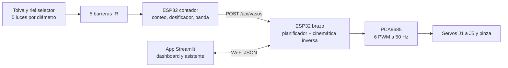

# Sistema de Logística de Monedas Inteligentes

Proyecto de Ingeniería Mecatrónica (UMNG). Dos etapas en un mismo sistema: un
riel selector que separa y cuenta monedas colombianas y las deja en vasos sobre
una banda, y un brazo de 5 GDL que recoge esos vasos y los ordena en un rack
esquivando cuatro obstáculos aéreos giratorios.


## Demos que se abren en el navegador

Activa GitHub Pages sobre la carpeta `docs/`:

| Demo | Qué muestra |
| --- | --- |
| [Simulación del sistema completo](docs/simulacion_sistema_completo.html) | Las dos etapas juntas, los cuatro obstáculos y la evasión en 5 GDL |
| [Memoria de cálculo](docs/memoria-calculo.html) | Cinemática, espacio de trabajo, trayectorias y pares, con calculadoras |

## Arquitectura



La etapa 1 separa por geometría: el riel abre su ranura por escalones (17,6 /
20,9 / 23,0 / 24,3 / 27,3 mm) y cada moneda cae en cuanto la luz supera su
diámetro. La etapa 2 resuelve la inversa en forma cerrada y ordena los vasos por
denominación, cantidad, valor o peso, esquivando los móviles con tres maniobras:
paso por debajo, rodeo interior recogiendo el brazo y espera de ventana.

## Estructura del repositorio

```
docs/                     documentación y demos web
├── 01-arquitectura.md … 05-pruebas.md
├── 06-medidas-cad.md     cotas del CAD frente a las del código
├── img/                  figuras generadas por scripts/generar_figuras.py
├── memoria-calculo.html
└── simulacion_sistema_completo.html

firmware/
├── esp32_brazo/          cinemática, trayectorias, planificador, PCA9685, Wi-Fi
└── tests/                núcleo del firmware compilado y probado en el PC

hardware/
├── bom.csv materiales.md
└── Modelos3D/
    ├── PLANOS BRACITO.pdf            planos del brazo real (SolidWorks)
    ├── stl/                          piezas de la celda generadas por código
    └── sistema_monedas_completo.3mf  52 piezas en 9 bandejas con ajustes

scripts/
├── geometria_stl.py      mallas y escritura de STL, sin dependencias
├── generar_stl.py        piezas imprimibles de la celda
├── generar_3mf.py        las reparte en bandejas con ajustes de impresión
├── verificar_alcance.py  comprueba que el brazo llegue a todos los puestos
└── generar_figuras.py    figuras de docs/img

sim/pybullet/             URDF, celda y simulación del brazo

software/
├── brazo/                cinemática, planificador, trayectorias, estática, protocolo
├── apps/                 cli_demo.py y streamlit_app.py
└── tests/                36 pruebas con pytest
```

## Arranque rápido

```bash
pip install -r requirements.txt
python software/apps/cli_demo.py --criterio valor --sentido asc   # ciclo sin hardware
python sim/pybullet/run_sim.py                                    # simulación con física
streamlit run software/apps/streamlit_app.py                      # dashboard
pytest software/tests -q && make -C firmware/tests                # pruebas
```

## Medidas: dos perfiles

El brazo del CAD no tiene las mismas cotas que la simulación, así que las
medidas viven en un perfil que se cambia en un solo sitio:

| Perfil | d₁ | L₁ | L₂ | L₃ | Arco |
| --- | --- | --- | --- | --- | --- |
| `simulacion` | 110 mm | 160 mm | 150 mm | 80 mm | 230 mm |
| `cad` | 87 mm | 100 mm | 95 mm (por medir) | 60 mm (por medir) | 97 mm |

```bash
BRAZO_PERFIL=cad python software/apps/cli_demo.py
python scripts/verificar_alcance.py --perfil cad
```

En Python se cambia con `BRAZO_PERFIL`; en el firmware, con `#define PERFIL_CAD`
en `firmware/esp32_brazo/config.h`. Detalle y qué falta medir en
[`docs/06-medidas-cad.md`](docs/06-medidas-cad.md).

## Piezas impresas

Las del brazo salen del CAD. Las de la celda se generan por código:

```bash
python scripts/generar_stl.py      # 19 STL en hardware/Modelos3D/stl
python scripts/generar_3mf.py      # 52 piezas en 9 bandejas, ajustes incluidos
```

La pareja crítica es $200 y $500: 1,3 mm separan sus diámetros, así que conviene
imprimir primero una probeta de la estación 3 y medirla con calibrador antes de
sacar el riel completo.

## Estado

- [x] Cinemática directa e inversa verificadas contra DH y contra el URDF
- [x] Planificador de orden por cuatro criterios y en los dos sentidos
- [x] Evasión en 5 GDL: paso por debajo, rodeo interior y espera de ventana
- [x] Simulación integrada de las dos etapas en el navegador
- [x] Firmware modular del brazo con pruebas en el PC
- [x] Piezas de la celda generadas por código, en STL y en 3MF
- [ ] Medir L₂ y L₃ en el CAD y cerrar el perfil real
- [ ] Subir el firmware del ESP32 contador y la simulación de la etapa 1
- [ ] Imprimir y montar la celda; calibrar luces y sensores

Licencia [MIT](LICENSE). Repositorio base del curso:
[dialejobv/U_Militar](https://github.com/dialejobv/U_Militar).
