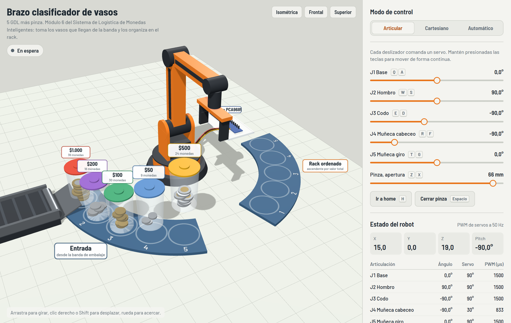
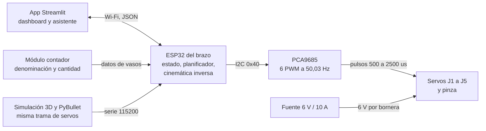
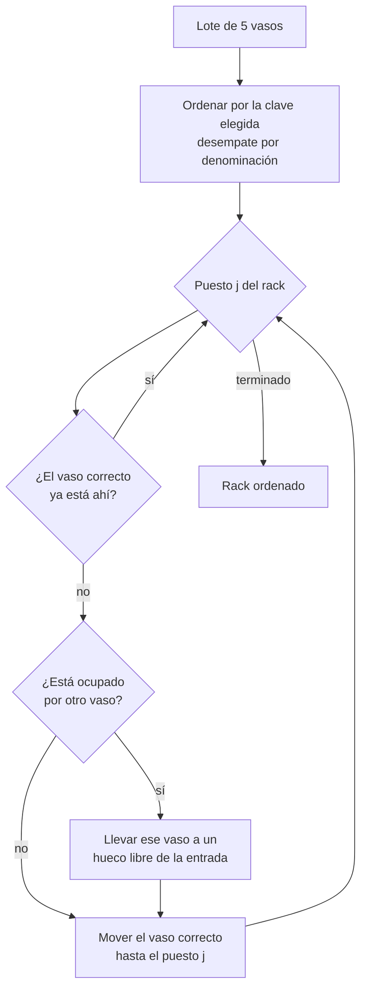
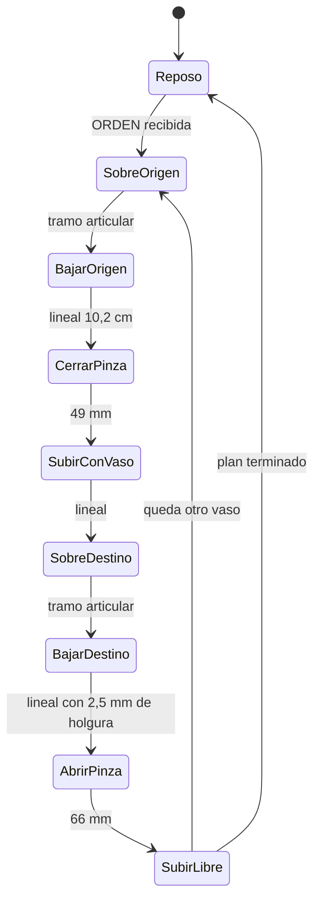
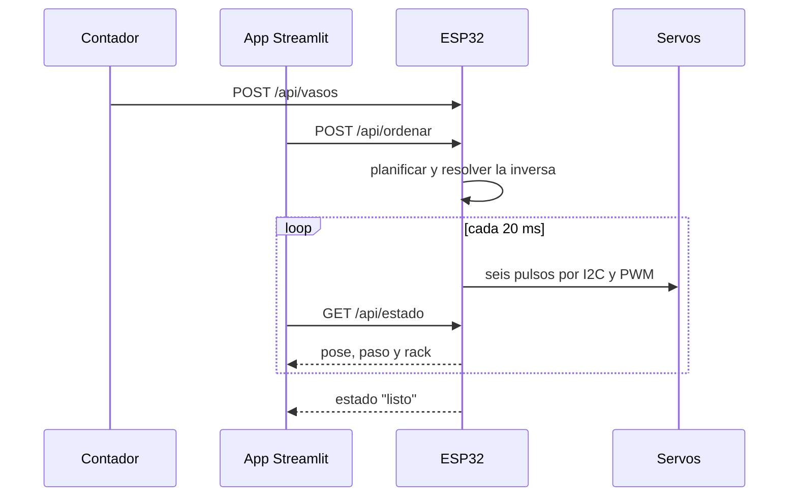
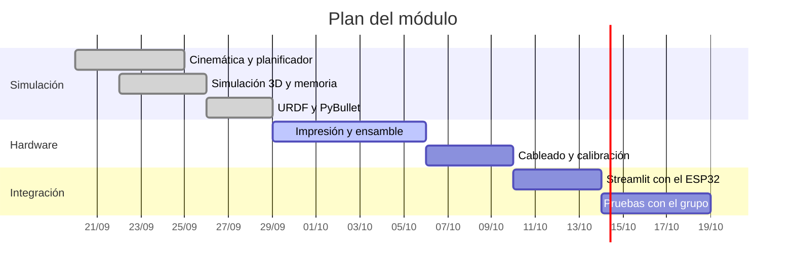

# Brazo clasificador de vasos de monedas

Brazo robótico de 5 grados de libertad más pinza que recoge los vasos llenos que
salen del contador de monedas y los deja ordenados en un rack de cinco puestos,
de forma ascendente o descendente por denominación, cantidad de monedas, valor o
peso. Es el **punto 6** del proyecto grupal *Sistema de Logística de Monedas
Inteligentes* de Ingeniería Mecatrónica, Universidad Militar Nueva Granada.




> **Demos que se abren en el navegador** (activa GitHub Pages sobre la carpeta `docs/`):
> [simulación 3D interactiva](docs/simulacion-3d.html) ·
> [memoria de cálculo con calculadoras en vivo](docs/memoria-calculo.html)

---

## Contenido

1. [Qué hace](#qué-hace)
2. [Arquitectura](#arquitectura)
3. [Estructura del repositorio](#estructura-del-repositorio)
4. [Arranque rápido](#arranque-rápido)
5. [Cinemática](#cinemática)
6. [Planificador de orden](#planificador-de-orden)
7. [Trayectorias y ciclo](#trayectorias-y-ciclo)
8. [Cargas y selección de servos](#cargas-y-selección-de-servos)
9. [Electrónica](#electrónica)
10. [Protocolo](#protocolo)
11. [Pruebas](#pruebas)
12. [Estado del avance](#estado-del-avance)

---

## Qué hace

| | |
| --- | --- |
| **Entrada** | Cinco vasos en el arco de entrada, con su denominación y cantidad de monedas |
| **Salida** | Los mismos cinco vasos en el rack, ordenados por el criterio elegido |
| **Criterios** | Denominación, cantidad de monedas, valor total o peso, ascendente o descendente |
| **Carga de diseño** | 416 g, un vaso con 40 monedas de $1.000 |
| **Ciclo** | 7,1 s por vaso a velocidad 1× |
| **Alcance** | 39 cm desde el eje del hombro; arco de trabajo a 23 cm |

La celda tiene diez puestos sobre un mismo arco: entrada E1 a E5 y rack R1 a R5.
Como comparten radio, la postura del brazo es idéntica en los diez y solo cambia
el giro de la base, lo que simplifica el plan y reparte el mismo error de
posicionamiento en todos los puestos.

<details>
<summary><b>Requisitos funcionales y no funcionales</b></summary>

| Código | Requisito | Verificación |
| --- | --- | --- |
| RF1 | Recoger en los cinco puestos de entrada y depositar en los cinco del rack | `software/tests/test_trajectory.py` |
| RF2 | Ordenar por cuatro criterios en ambos sentidos | `software/tests/test_planner.py` |
| RF3 | Recibir órdenes y datos de vasos desde la app | `docs/04-protocolo.md` |
| RF4 | Reportar pose, estado y contenido del rack | `brazo/protocol.py` |
| RF5 | Modo manual articular y cartesiano | simulación 3D y comando `S:` |
| RNF1 | Mínimo 4 GDL | 5 GDL más pinza |
| RNF2 | Carga útil de 416 g | `software/tests/test_statics.py` |
| RNF3 | Tolerancia de ±5 mm | resolución de 1,8 mm, holgura de pinza de 7 mm |
| RNF4 | Ciclo menor a 10 s por vaso | 7,1 s medidos |
| RNF5 | Potencia separada de la lógica | `docs/03-electronica.md` |
| RNF6 | Piezas imprimibles y de bajo costo | `hardware/bom.csv` |

</details>

---

## Arquitectura



El mismo algoritmo vive en dos lados y se prueba en los dos: en Python, para
simular y para el dashboard, y en C++ dentro del ESP32. Los parámetros están
duplicados a propósito en `software/brazo/config.py` y `firmware/esp32_brazo/config.h`,
y hay pruebas que comparan los resultados de ambos contra los mismos números.

---

## Estructura del repositorio

```
brazo-clasificador-monedas/
├── firmware/
│   ├── esp32_brazo/            # sketch de Arduino, un módulo por responsabilidad
│   │   ├── esp32_brazo.ino     # setup y loop: 50 Hz de control
│   │   ├── config.h            # geometría, límites, celda, pines, PWM
│   │   ├── kinematics.*        # directa e inversa cerradas
│   │   ├── trajectory.*        # perfil quíntico y duración de tramos
│   │   ├── cups.*              # vasos, masas de monedas y claves de orden
│   │   ├── planner.*           # plan de movimientos
│   │   ├── sequencer.*         # máquina de estados del ciclo
│   │   ├── servo_bus.*         # PCA9685, rampa y PWM
│   │   ├── comms.*             # serie y servidor HTTP JSON
│   │   └── secrets_example.h   # copiar a secrets.h con tu Wi-Fi
│   └── tests/                  # el núcleo del firmware compilado y probado en el PC
├── software/
│   ├── brazo/                  # paquete Python con la misma lógica
│   │   ├── config.py           # única fuente de verdad del lado del PC
│   │   ├── kinematics.py       # fk, ik, DH, jacobiano
│   │   ├── trajectory.py       # tramos y muestreo a 50 Hz
│   │   ├── cups.py             # modelo de vasos y criterios
│   │   ├── planner.py          # algoritmo de orden
│   │   ├── statics.py          # pares y factores de seguridad
│   │   ├── protocol.py         # trama de servos y JSON de estado
│   │   ├── links.py            # enlace serie, HTTP o simulado
│   │   └── controller.py       # orquestador del ciclo completo
│   ├── apps/
│   │   ├── cli_demo.py         # corre la clasificación sin hardware
│   │   └── streamlit_app.py    # dashboard y asistente
│   └── tests/                  # 36 pruebas con pytest
├── sim/pybullet/
│   ├── brazo_clasificador.urdf # modelo del robot en metros y radianes
│   ├── celda.py                # bandejas y vasos con masa real
│   └── run_sim.py              # simulación con física
├── docs/                       # documentación, figuras y las dos páginas web
├── hardware/                   # lista de materiales y justificación
└── scripts/generar_figuras.py  # regenera las figuras desde el código
```

---

## Arranque rápido

```bash
git clone https://github.com/TU-USUARIO/brazo-clasificador-monedas.git
cd brazo-clasificador-monedas
pip install -r requirements.txt
```

**Ver la clasificación completa sin hardware**

```bash
python software/apps/cli_demo.py --criterio valor --sentido asc
```

```
Plan por valor asc: 5 movimientos, 35.48 s a velocidad 1.0x
  1. Vaso de $50 x 25 de entrada 4 a rack 1
  2. Vaso de $100 x 30 de entrada 2 a rack 2
  3. Vaso de $200 x 17 de entrada 5 a rack 3
  4. Vaso de $500 x 12 de entrada 1 a rack 4
  5. Vaso de $1.000 x 8 de entrada 3 a rack 5
```

**Simulación con física**

```bash
python sim/pybullet/run_sim.py --criterio peso --sentido desc
```

**Dashboard**

```bash
streamlit run software/apps/streamlit_app.py
```

**Firmware**

<details>
<summary>Pasos en el IDE de Arduino</summary>

1. Instalar el soporte de placas ESP32 y la librería *Adafruit PWM Servo Driver*.
2. Copiar `firmware/esp32_brazo/secrets_example.h` como `secrets.h` y poner la red Wi-Fi.
3. Abrir `firmware/esp32_brazo/esp32_brazo.ino` y subir a un ESP32 DevKit V1.
4. Abrir el monitor serie a 115200 y probar:

```
VASOS:500x12,100x30,1000x8,50x25,200x17
ORDEN:valor,asc
ESTADO
```

Conecta la potencia de 6 V solo después de verificar que las tramas llegan bien.
</details>

---

## Cinemática


Cadena antropomórfica con los tres ejes centrales paralelos, así que la inversa
tiene solución cerrada: el ESP32 la resuelve con seis llamadas trigonométricas,
sin iterar.

| Articulación | Rango | Home | Ángulo de servo | Eslabón | Longitud |
| --- | --- | --- | --- | --- | --- |
| J1 base | −90° a 90° | 0° | s₁ = θ₁ + 90° | d₁ hombro | 11 cm |
| J2 hombro | 0° a 180° | 90° | s₂ = θ₂ | L₁ brazo | 16 cm |
| J3 codo | −150° a 0° | −90° | s₃ = −θ₃ | L₂ antebrazo | 15 cm |
| J4 cabeceo | −120° a 60° | −90° | s₄ = θ₄ + 120° | L₃ muñeca al TCP | 8 cm |
| J5 giro | −90° a 90° | 0° | s₅ = θ₅ + 90° | pinza | 0 a 70 mm |

```
ρ = L₁·cos θ₂ + L₂·cos(θ₂+θ₃) + L₃·cos(θ₂+θ₃+θ₄)
X = ρ·cos θ₁      Y = ρ·sen θ₁      Z = d₁ + L₁·sen θ₂ + L₂·sen(θ₂+θ₃) + L₃·sen(θ₂+θ₃+θ₄)
```

Inversa, paso a paso: se descuenta el último eslabón para hallar el centro de
muñeca, se saca el codo con la ley de cosenos y el resto sale por diferencia.

```
r_w = r − L₃·cos φ                 h_w = h − L₃·sen φ
D   = (r_w² + h_w² − L₁² − L₂²) / (2·L₁·L₂)
θ₃  = −arccos D                    (codo arriba: la raíz positiva viola el rango de J3)
θ₂  = atan2(h_w, r_w) − atan2(L₂·sen θ₃, L₁ + L₂·cos θ₃)
θ₄  = φ − θ₂ − θ₃
```

Ejemplo verificado en las pruebas, agarre en el puesto R1:

| X | Y | Z | φ | θ₁ | θ₂ | θ₃ | θ₄ | Trama |
| --- | --- | --- | --- | --- | --- | --- | --- | --- |
| 21,01 | 9,35 | 6,80 | −90° | 24,00° | 49,02° | −82,53° | −56,50° | `S:114,49,83,64,90,85` |


Con la pinza vertical el brazo alcanza entre 7,14 y 30,76 cm a la altura de
agarre, y hasta 27,65 cm a la altura de traslado. El arco de puestos quedó a
23 cm para trabajar lejos del borde y lejos de la singularidad (`det J = L₁·L₂·sen θ₃`,
que solo se anula con el brazo estirado).

Detalle completo en [`docs/02-cinematica.md`](docs/02-cinematica.md) y en la
[memoria interactiva](docs/memoria-calculo.html).

---

## Planificador de orden



Desde la entrada son exactamente cinco movimientos; reordenar un rack lleno son
diez como máximo, y nunca se queda sin hueco porque cada vaso que sale del rack
libera uno. Los criterios no coinciden entre sí, que es justo la gracia del
módulo: un vaso con 30 monedas de $100 vale $3.000 y pesa 118 g, mientras que uno
con 8 de $1.000 vale $8.000 y pesa 98 g.

| Vaso | Monedas | Valor | Peso | Orden por valor | Orden por peso |
| --- | --- | --- | --- | --- | --- |
| $50 | 25 | $1.250 | 68,0 g | 1 | 1 |
| $100 | 30 | $3.000 | 118,2 g | 2 | 5 |
| $200 | 17 | $3.400 | 96,4 g | 3 | 2 |
| $500 | 12 | $6.000 | 103,7 g | 4 | 4 |
| $1.000 | 8 | $8.000 | 97,6 g | 5 | 3 |

---

## Trayectorias y ciclo


Todos los movimientos usan el mismo perfil, que arranca y termina con velocidad y
aceleración nulas:

```
θ(t) = θ₀ + Δθ·(10τ³ − 15τ⁴ + 6τ⁵)      θ̇_max = 1,875·Δθ/T      θ̈_max = 5,7735·Δθ/T²
```

El giro más largo posible, de E1 a R5, son 172° en 2,29 s con un pico de 141 °/s:
la tercera parte de lo que da un MG996R a 6 V.



Durante el traslado el vaso sujeto viaja con su base a 10,8 cm y los vasos que ya
están en sus puestos llegan a 8,9 cm: quedan 1,9 cm de holgura vertical.

---

## Cargas y selección de servos


Caso de diseño: vaso con 40 monedas de $1.000, 416 g en la pinza.

| Articulación | Par en operación | Par extendido | Servo elegido | Par a 6 V | FS operación |
| --- | --- | --- | --- | --- | --- |
| J1 base | 1,00 kg·cm | — | MG996R + rodamiento axial 51107 | 11 kg·cm | 11,0 |
| J2 hombro | 13,60 kg·cm | 22,07 kg·cm | DS3235MG | 32 kg·cm | 2,35 |
| J3 codo | 6,82 kg·cm | 11,74 kg·cm | DS3218MG | 20,4 kg·cm | 2,99 |
| J4 muñeca | 0,00 kg·cm | 3,56 kg·cm | MG996R | 11 kg·cm | — |
| J5 giro | ≈0 | ≈0 | MG90S | 2,2 kg·cm | — |
| Pinza | 1,25 kg·cm | — | MG90S | 2,2 kg·cm | 1,76 |

Con la pinza vertical la muñeca no carga nada, porque el vaso cuelga justo debajo
del eje. El rodamiento axial saca la carga del eje del servo de la base, y el
momento de vuelco de 1,33 N·m se resuelve atornillando la placa a la mesa en vez
de lastrarla. Las masas de los eslabones son estimaciones de PETG al 35 % y se
reemplazan en `software/brazo/statics.py` cuando esté el CAD.

---

## Electrónica

```
prescale = round(25 MHz / (4096 × 50 Hz)) − 1 = 121   →   f = 50,03 Hz, tick = 4,88 us
t_on = 500 us + (s / 180°) × 2000 us                  →   resolución 0,44° = 1,8 mm en el TCP
```

| Canal | Servo | Corriente de bloqueo a 6 V |
| --- | --- | --- |
| 0 | MG996R (J1) | 2,5 A |
| 1 | DS3235MG (J2) | ≈3,5 A |
| 2 | DS3218MG (J3) | 1,8 a 2,6 A |
| 3 | MG996R (J4) | 2,5 A |
| 4 | MG90S (J5) | ≈0,8 A |
| 5 | MG90S (pinza) | ≈0,8 A |

Suma en el peor caso 12,7 A, que es una falla y no una condición de trabajo: se
dimensiona una fuente de 6 V y 10 A con un condensador de 2.200 µF en la bornera.
La potencia va por bornera propia con 18 AWG, no por las pistas del PCA9685.
Conexiones completas en [`docs/03-electronica.md`](docs/03-electronica.md) y
materiales en [`hardware/bom.csv`](hardware/bom.csv).

---

## Protocolo

Una línea de texto por pose, la misma que produce la simulación:

```
S:114,49,83,64,90,85
```



| Comando serie | Efecto |
| --- | --- |
| `S:j1,j2,j3,j4,j5,pinza` | Pose directa, modo manual |
| `VASOS:500x12,100x30,...` | Carga el lote de la entrada |
| `ORDEN:valor,asc` | Clasifica con ese criterio y sentido |
| `ESTADO` / `HOME` / `STOP` | Estado en JSON, reposo, abortar |
| `PAUSA` / `SIGUE` / `TORQUE0` / `TORQUE1` | Control del ciclo y del torque |

---

## Pruebas

```bash
pytest software/tests -q      # 36 pruebas de cinemática, plan, trayectorias, estática y URDF
make -C firmware/tests        # el núcleo del firmware, compilado y corrido en el PC
```

```
  ok   ik del puesto R1 coincide con la memoria de calculo
  ok   los diez puestos resuelven ida y vuelta a las dos alturas
  ok   trama del puesto R1
  ok   el rack queda ordenado de $50 a $1000
  ok   el brazo vuelve al reposo
  ciclo simulado: 37.0 s en 1851 vueltas de control
```

Las pruebas del firmware usan un `BusServos` de banco, así que ejecutan la
máquina de estados completa sin hardware. Las de Python comparan además el URDF
de PyBullet contra la cinemática analítica. Todo corre en GitHub Actions
([`.github/workflows/pruebas.yml`](.github/workflows/pruebas.yml)).

---

## Estado del avance

- [x] Cinemática directa e inversa cerradas, verificadas contra DH y contra el URDF
- [x] Planificador de orden con los cuatro criterios y los dos sentidos
- [x] Trayectorias con perfil quíntico y ciclo de ocho tramos
- [x] Simulación 3D en el navegador y memoria de cálculo interactiva
- [x] Modelo URDF y escena de PyBullet con masas reales
- [x] Firmware modular para ESP32 con PCA9685, serie y servidor HTTP
- [x] Dashboard en Streamlit con asistente de consulta
- [x] Pruebas automáticas en Python y en C++
- [ ] Impresión de eslabones y montaje mecánico
- [ ] Calibración de los desfases reales de cada bocina
- [ ] Integración con el módulo contador y con el minitanque del grupo
- [ ] Medición de tiempo de ciclo y repetibilidad sobre el prototipo



---

## Créditos

Proyecto de Ingeniería Mecatrónica, Universidad Militar Nueva Granada.
Módulo del brazo clasificador dentro del *Sistema de Logística de Monedas
Inteligentes*, que integra además el contador de monedas, el sistema de
transporte y embalaje y el minitanque de recolección. Repositorio base del curso:
[dialejobv/U_Militar](https://github.com/dialejobv/U_Militar).

Masas de moneda tomadas de la serie 2012 del Banco de la República.
Licencia [MIT](LICENSE).
