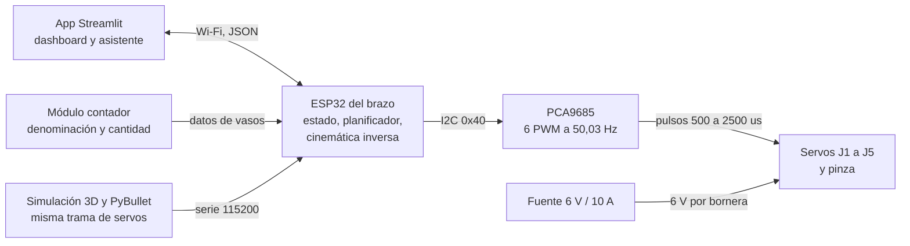
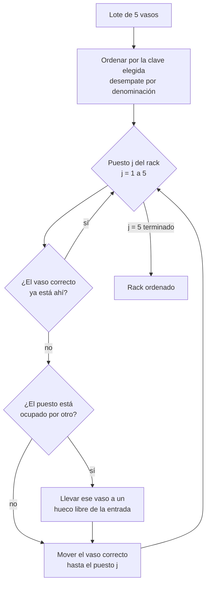

# Arquitectura del módulo

El brazo es un nodo del Sistema de Logística de Monedas Inteligentes. Recibe los
datos de cada vaso que produce el contador y la orden de clasificar; devuelve su
estado para el dashboard.

## Requisitos

| Código | Requisito | Dónde se verifica |
| --- | --- | --- |
| RF1 | Recoger vasos en los cinco puestos de entrada y depositarlos en los cinco del rack | `software/tests/test_trajectory.py`, `firmware/tests` |
| RF2 | Ordenar por denominación, cantidad, valor o peso, en ambos sentidos | `software/tests/test_planner.py` |
| RF3 | Recibir órdenes y datos de vasos desde la app | `docs/04-protocolo.md` |
| RF4 | Reportar pose, estado y contenido del rack | `brazo/protocol.py::estado_json` |
| RF5 | Modo manual articular y cartesiano para calibrar | simulación 3D y comando `S:` |
| RNF1 | Mínimo 4 GDL | 5 GDL más pinza |
| RNF2 | Carga útil de 416 g (vaso con 40 monedas de $1.000) | `software/tests/test_statics.py` |
| RNF3 | Tolerancia de ±5 mm en los puestos | resolución de 1,8 mm, holgura de pinza de 7 mm |
| RNF4 | Ciclo menor a 10 s por vaso a velocidad 1× | 7,1 s medidos en `cli_demo` |
| RNF5 | Potencia de servos separada de la lógica, con tierra común | `docs/03-electronica.md` |
| RNF6 | Piezas imprimibles en 3D y componentes de bajo costo | `hardware/bom.csv` |

## Bloques

## Responsabilidades

| Bloque | Qué hace | Qué no hace |
| --- | --- | --- |
| App Streamlit | Elige criterio y sentido, muestra ruta, valor, peso y cantidad | No calcula cinemática |
| ESP32 | Guarda el estado de los diez puestos, planifica, resuelve la inversa y comanda | No decide el criterio |
| PCA9685 | Genera los seis PWM por hardware | No conoce la geometría |
| Simulación | Reemplaza al hardware mientras se construye | No sustituye la calibración real |

## La celda

Diez puestos sobre un arco de radio 23 cm: entrada E1 a E5 entre −86° y −24°,
rack R1 a R5 entre 24° y 86°, separados 15,5°. La cuerda entre puestos vecinos es
6,20 cm y el vaso mide 5,2 cm, así que quedan 1,0 cm libres. Como todos comparten
radio, la postura del brazo es la misma en los diez y solo cambia θ₁: eso
simplifica el plan y hace que el error de posicionamiento sea parejo.

## Algoritmo de orden

Desde la entrada son exactamente cinco movimientos. Reordenando un rack ya lleno
son como máximo diez, porque cada vez que se saca un vaso del rack se libera un
hueco de entrada.
