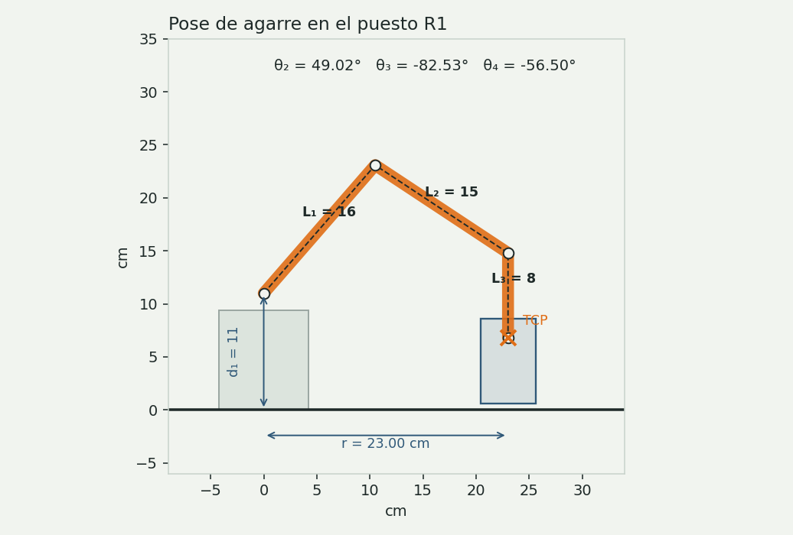
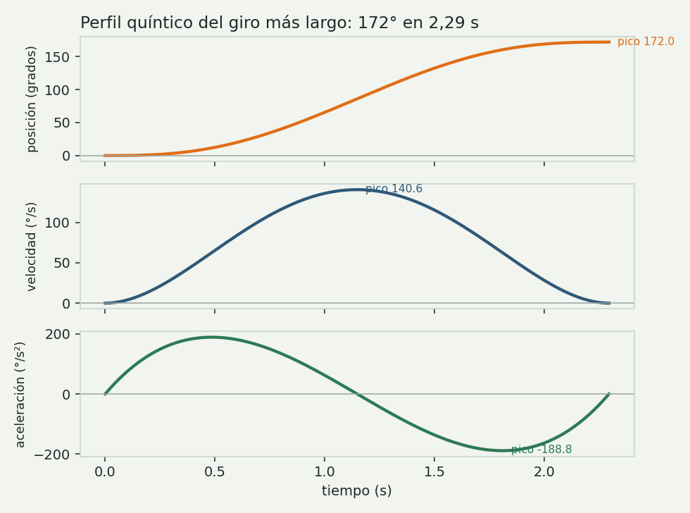

# Cinemática, trayectorias y cargas

Todas las longitudes en centímetros y los ángulos en grados. La memoria completa
con las calculadoras interactivas está en
[memoria-calculo.html](memoria-calculo.html).

## Parámetros

| Símbolo | Descripción | Valor |
| --- | --- | --- |
| d₁ | Altura del eje del hombro | 11 cm |
| L₁ | Hombro a codo | 16 cm |
| L₂ | Codo a muñeca | 15 cm |
| L₃ | Muñeca al TCP | 8 cm |
| a | Apertura de la pinza | 0 a 70 mm |

| Articulación | Rango | Home | Ángulo de servo |
| --- | --- | --- | --- |
| J1 base | −90° a 90° | 0° | s₁ = θ₁ + 90° |
| J2 hombro | 0° a 180° | 90° | s₂ = θ₂ |
| J3 codo | −150° a 0° | −90° | s₃ = −θ₃ (montaje invertido) |
| J4 cabeceo | −120° a 60° | −90° | s₄ = θ₄ + 120° |
| J5 giro | −90° a 90° | 0° | s₅ = θ₅ + 90° |
| Pinza | 0 a 70 mm | 66 mm | s₆ = 90°·a/70 mm |

θ₂ se mide desde la horizontal; θ₃ y θ₄ son relativos al eslabón anterior, y
φ = θ₂ + θ₃ + θ₄ es el cabeceo absoluto de la pinza (−90° apuntando hacia abajo).

## Tabla Denavit-Hartenberg

| i | θᵢ | dᵢ (cm) | aᵢ (cm) | αᵢ |
| --- | --- | --- | --- | --- |
| 1 | θ₁ | 11 | 0 | 90° |
| 2 | θ₂ | 0 | 16 | 0° |
| 3 | θ₃ | 0 | 15 | 0° |
| 4 | θ₄ + 90° | 0 | 0 | 90° |
| 5 | θ₅ | 8 | 0 | 0° |

El desfase de 90° en θ₄ alinea z₄ con el eje de aproximación de la pinza. El
producto de las cinco matrices se comparó con la forma cerrada en 500 poses
aleatorias (`test_dh_coincide_con_la_forma_cerrada`) y en el URDF de PyBullet
(`test_urdf.py`): el error máximo es ruido numérico.

## Cinemática directa

Con ρ la extensión radial:

```
ρ  = L₁·cos θ₂ + L₂·cos(θ₂+θ₃) + L₃·cos(θ₂+θ₃+θ₄)
X  = ρ·cos θ₁
Y  = ρ·sen θ₁
Z  = d₁ + L₁·sen θ₂ + L₂·sen(θ₂+θ₃) + L₃·sen(θ₂+θ₃+θ₄)
φ  = θ₂ + θ₃ + θ₄
```

En reposo (0°, 90°, −90°, −90°, 0°) queda el TCP en (15, 0, 19) cm con la pinza
mirando hacia abajo.

## Cinemática inversa



1. `θ₁ = atan2(Y, X)`
2. `r = √(X² + Y²)`, `h = Z − d₁`
3. Centro de muñeca: `r_w = r − L₃·cos φ`, `h_w = h − L₃·sen φ`
4. `D = (r_w² + h_w² − L₁² − L₂²) / (2·L₁·L₂)`; si `|D| > 1` no hay solución
5. `θ₃ = −arccos D` (codo arriba; la raíz positiva cae fuera del rango de J3)
6. `θ₂ = atan2(h_w, r_w) − atan2(L₂·sen θ₃, L₁ + L₂·cos θ₃)`
7. `θ₄ = φ − θ₂ − θ₃`, `θ₅ = ψ`
8. Validar cada ángulo contra su rango

Ejemplo del puesto R1 a la altura de agarre (X = 21,01; Y = 9,35; Z = 6,80; φ = −90°):

| Paso | Resultado |
| --- | --- |
| θ₁ | 24,00° |
| r, h | 23,00 cm; −4,20 cm |
| r_w, h_w | 23,00 cm; 3,80 cm |
| D | 0,1301 |
| θ₃ | −82,53° |
| θ₂ | 49,02° |
| θ₄ | −56,50° |
| Trama | `S:114,49,83,64,90,85` |

## Jacobiano

```
det J = L₁·L₂·sen θ₃
```

Solo se anula con el brazo estirado (θ₃ = 0), que es justo el límite de J3. En la
pose de agarre θ₃ = −82,5° y |det J| = 238 cm², prácticamente el máximo.

## Espacio de trabajo


| Condición | Radio mínimo | Radio máximo |
| --- | --- | --- |
| Pinza vertical a 6,8 cm | 7,14 cm | 30,76 cm |
| Pinza vertical a 17 cm | 0 cm | 27,65 cm |
| Cualquier orientación | 1 cm | 39 cm |

## Trayectorias



```
θ(t) = θ₀ + Δθ·(10τ³ − 15τ⁴ + 6τ⁵),  τ = t/T
θ̇_max = 1,875·Δθ/T      θ̈_max = 5,7735·Δθ/T²
```

Cada vaso se mueve en ocho tramos: articular sobre el origen, bajada lineal,
cierre de pinza, subida, traslado articular, bajada, apertura y subida. Durante
el traslado el vaso sujeto viaja con su base a 10,8 cm y los demás llegan a
8,9 cm: quedan 1,9 cm de holgura. El ciclo completo por vaso ronda los 7,1 s a
velocidad 1×.

## Estática y servos


Caso de diseño: vaso con 40 monedas de $1.000, 416 g.

| Articulación | Par en operación | Par extendido | Servo | Par a 6 V | FS operación |
| --- | --- | --- | --- | --- | --- |
| J1 base | 1,00 kg·cm | — | MG996R con rodamiento axial | 11 kg·cm | 11,0 |
| J2 hombro | 13,60 kg·cm | 22,07 kg·cm | DS3235MG | 32 kg·cm | 2,35 |
| J3 codo | 6,82 kg·cm | 11,74 kg·cm | DS3218MG | 20,4 kg·cm | 2,99 |
| J4 muñeca | 0,00 kg·cm | 3,56 kg·cm | MG996R | 11 kg·cm | — |
| Pinza | 1,25 kg·cm | — | MG90S | 2,2 kg·cm | 1,76 |

El momento de vuelco en operación es de 1,33 N·m, así que la placa base va
atornillada a la mesa en lugar de lastrada.
