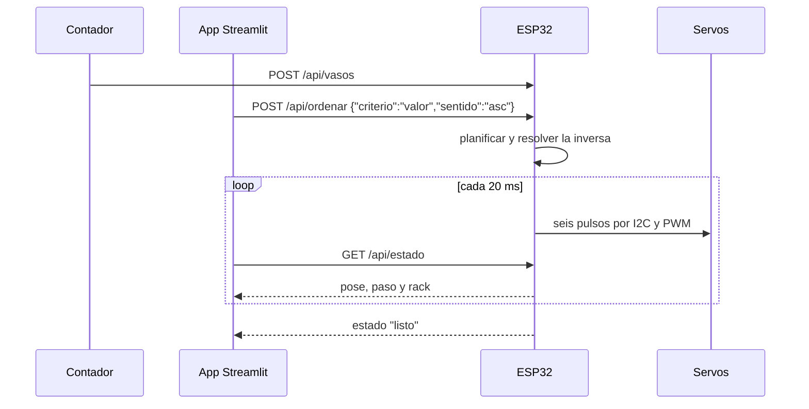

# Protocolo de comunicación

## Nivel bajo: una línea por pose

```
S:114,49,83,64,90,85
```

Seis ángulos de servo en grados enteros: J1 a J5 y la pinza (0 a 90°). La trama
ocupa 21 caracteres, unos 1,8 ms a 115200 baudios; enviándola a 50 Hz usa el 9 %
del enlace. Es la misma cadena que muestra la simulación 3D, así que pasar de
simulado a real no cambia la lógica de control.

## Comandos de texto por el puerto serie

| Comando | Efecto |
| --- | --- |
| `S:j1,j2,j3,j4,j5,pinza` | Pose directa, modo manual |
| `VASOS:500x12,100x30,1000x8,50x25,200x17` | Carga el lote de la entrada |
| `ORDEN:valor,asc` | Clasifica (`valor`, `peso`, `cantidad`, `denominacion`) |
| `ESTADO` | Devuelve el JSON de estado |
| `HOME` | Lleva el brazo al reposo |
| `PAUSA` / `SIGUE` | Pausa o reanuda la secuencia |
| `STOP` | Aborta el plan |
| `TORQUE0` / `TORQUE1` | Corta o repone el torque de los servos |

## Nivel alto: JSON por Wi-Fi

| Ruta | Quién la usa | Contenido |
| --- | --- | --- |
| `POST /api/vasos` | Módulo contador | denominación y cantidad de cada puesto |
| `POST /api/ordenar` | App Streamlit | criterio y sentido |
| `POST /api/pose` | Modo manual | una trama `S:` |
| `GET /api/estado` | Dashboard | pose, paso en curso y contenido del rack |

```json
{
  "estado": "moviendo",
  "paso": 3, "total": 5,
  "q": [24.0, 49.0, -82.5, -56.5, 0.0],
  "pinza_mm": 49,
  "trama": "S:114,49,83,64,90,85",
  "vasos": [
    {"zona": "rack", "puesto": 1, "den": 50, "n": 25, "valor": 1250, "peso_g": 68.0}
  ]
}
```

## Secuencia típica



La app consulta el estado cada 500 ms, suficiente para la barra de progreso y el
mapa de la ruta. Si el contador termina siendo otro ESP32, el enlace entre los dos
puede hacerse por ESP-NOW y dejar el Wi-Fi solo para la app.
